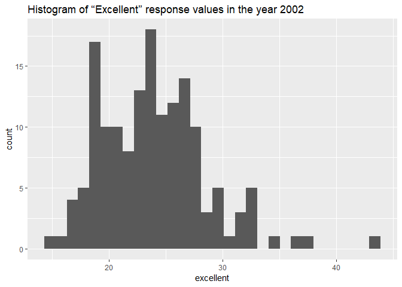
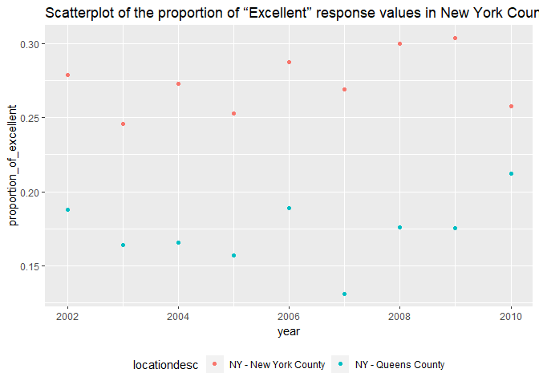

p8105\_hw2\_rh2916
================
Rui Huang
September 29, 2018

## Problem 1

## Read and manipulate Data

``` r
Problem1_data =
  read_csv(file = './data/NYC_Transit_Subway_Entrance_And_Exit_Data.csv') %>%
  janitor::clean_names() %>%
  select(line, station_name, station_latitude, station_longitude, route1: route11, 
         entry, vending, entrance_type, ada) %>%
  mutate(
    entry = recode(entry, "YES" = TRUE, "NO" = FALSE)
  )
```

    ## Parsed with column specification:
    ## cols(
    ##   .default = col_character(),
    ##   `Station Latitude` = col_double(),
    ##   `Station Longitude` = col_double(),
    ##   Route8 = col_integer(),
    ##   Route9 = col_integer(),
    ##   Route10 = col_integer(),
    ##   Route11 = col_integer(),
    ##   ADA = col_logical(),
    ##   `Free Crossover` = col_logical(),
    ##   `Entrance Latitude` = col_double(),
    ##   `Entrance Longitude` = col_double()
    ## )

    ## See spec(...) for full column specifications.

The Problem1\_data dataset contains 19 variables, they are line,
station\_name, station\_latitude, station\_ongitude, routes1:route11,
entry, vending, entrance type and ada. After reading the dataset, I
first clean the variable names using clean\_names function, then retain
the variables I need by select function, and convert the entry variable
from character to a logical variable by mutate and recode function. The
dimension of the resulting dataset is 1868, 19 (rows x columns). It is
not tidy since the route name and route number are messy.

## How many distinct stations are there?

``` r
Problem1_data %>% 
  distinct(line, station_name) %>% 
  nrow()
```

    ## [1] 465

There are 465 stations.

## How many stations are ADA compliant?

``` r
Problem1_data %>% 
  filter(ada == "TRUE") %>%
  distinct(line, station_name) %>% 
  nrow()
```

    ## [1] 84

84 stations are ADA
compliant.

## What proportion of station entrances / exits without vending allow entrance?

``` r
Problem1_data_novending_entrance =
  Problem1_data %>% 
  filter(vending == "NO" & entry == TRUE) 
Problem1_data_novending = 
  Problem1_data %>%
  filter(vending == "NO")
nrow(Problem1_data_novending_entrance)/nrow(Problem1_data_novending)
```

    ## [1] 0.3770492

37.7% of station entrances / exits without vending allow entrance.

## Reformat route variables.

``` r
Problem1_data %>%
  gather(key = route_number, value = route_name, route1:route11) %>%
  filter(route_name == "A") %>%
  distinct(line, station_name) %>%
  nrow()
```

    ## [1] 60

``` r
Problem1_data %>%
  gather(key = route_number, value = route_name, route1:route11) %>%
  filter(route_name == "A" & ada == TRUE) %>%
  distinct(line, station_name) %>%
  nrow()
```

    ## [1] 17

60 distinct stations serve the A train. Of the stations that serve the A
train, 17 stations are ADA compliant.

## Problem 2

## Read and clean the Mr. Trash Wheel sheet:

``` r
problem2_data_dumpster = 
  readxl::read_xlsx("./data/HealthyHarborWaterWheelTotals2018-7-28.xlsx", sheet = "Mr. Trash Wheel", range = "A2:N338") %>%
  janitor::clean_names() %>%
  filter(!is.na(dumpster)) %>%
  mutate(
    sports_balls = round(sports_balls),
    sports_balls = as.integer(sports_balls)
  )
```

## Read, clean and combine precipitation data for 2016 and 2017.

``` r
problem2_data_2016 = 
  readxl::read_xlsx("./data/HealthyHarborWaterWheelTotals2018-7-28.xlsx", sheet = 
                      "2016 Precipitation", range = "A2:B14") %>%
  janitor::clean_names() %>%
  filter(!is.na(total)) %>%
  mutate(
    year = 2016
  )
```

``` r
problem2_data_2017 = 
  readxl::read_xlsx("./data/HealthyHarborWaterWheelTotals2018-7-28.xlsx", sheet = 
                      "2017 Precipitation", range = "A2:B14") %>%
  janitor::clean_names() %>%
  filter(!is.na(total)) %>%
  mutate(
    year = 2017
  )
```

``` r
problem2_data_rbind = rbind(problem2_data_2016, problem2_data_2017) 
problem2_data_rbind$month = month.name[problem2_data_rbind$month]
```

## Explanation of the datasets

For problem2\_data\_dumpster, the number of observations is 285, the
number of variables is 14. The key variables can be dumpster, date,
weight\_tons and volume\_cubic\_yards. By the key variables, we can know
the basic information of the waste. For example, through the key
variables, we know that for dumpster 1 it had 4.31 and 18 cubic yards
tons waste at the day 2014-05-16. Also, from other variable we can know
more specific imformations that class bottles are a main component while
sports balls are not for dumpster 1 at 2014-05-16.

For problem2\_data\_rbind, the number of observations is 24, the number
of variables is 3. The three variables, total, month and year are all
key variables to know the general information about the precipitation.
For example, from the variables, we know that the total precipitation in
January 2016 is 3.23.

## What was the total precipitation in 2017?

For available data, the total precipitation in 2017 was 32.93.

## What was the median number of sports balls in a dumpster in 2016?

The median number of sports balls in a dumpster in 2016 is 26.

## Problem 3

## Read and manipulate data

``` r
library(p8105.datasets)
data(brfss_smart2010)
```

``` r
problem3_data =
  brfss_smart2010 %>%
  janitor::clean_names() %>%
  filter(topic == "Overall Health" ) %>%
  select(-class, -topic, -question, -sample_size, -(confidence_limit_low :    geo_location)) %>%
  spread(key = response, value = data_value) %>%
  janitor::clean_names() %>%
  mutate(    
    proportion_of_excellent = excellent/ (excellent + fair + good + poor + very_good),
    proportion_of_very_good = very_good / (excellent + fair + good + poor + very_good)
  )
```

## How many unique locations? What state is observed the most?

``` r
problem3_data %>%
  distinct(locationdesc) %>%
  nrow()
```

    ## [1] 404

``` r
problem3_data %>%
  distinct(locationabbr) %>%
  nrow() == 51
```

    ## [1] TRUE

``` r
mode <- function(x) {
    ux <- unique(x)
    ux[which.max(tabulate(match(x, ux)))]
}
mode(problem3_data$locationabbr)
```

    ## [1] "NJ"

404 unique locations are included in the dataset. 51 states are
represented which means every state (including 50 states and DC) is
represented. The state “NJ” is observed the most.

## In 2002, what is the median of the “Excellent” response value?

``` r
problem3_data_2002 = filter(problem3_data, year == 2002)
median(problem3_data_2002$excellent, na.rm = TRUE)
```

    ## [1] 23.6

In 2002, the median of the “Excellent” response value is 23.6.

Make a histogram of “Excellent” response values in the year 2002.

``` r
ggplot(problem3_data_2002, aes(x = excellent)) + 
  geom_histogram() +
  ggtitle("Histogram of “Excellent” response values in the year 2002")
```

    ## `stat_bin()` using `bins = 30`. Pick better value with `binwidth`.

    ## Warning: Removed 2 rows containing non-finite values (stat_bin).

<!-- -->

Make a scatterplot showing the proportion of “Excellent” response values
in New York County and Queens County (both in NY State) in each year
from 2002 to 2010.

``` r
problem3_data_scat = 
  filter(problem3_data, locationdesc == "NY - New York County" | locationdesc == "NY - Queens County")
ggplot(problem3_data_scat, aes(x = year, y = proportion_of_excellent, color = locationdesc)) + 
  geom_point() +
  ggtitle("Scatterplot of the proportion of “Excellent” response values in New York County and Queens County") +
  theme(legend.position = "bottom")
```

<!-- -->
